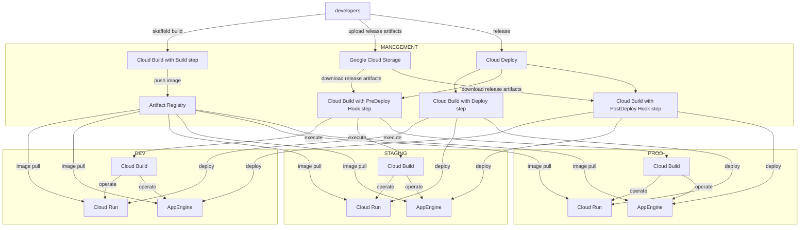

DockerImage Build, Push and Deploy to GCP Cloud Run And AppEngine via GCP Cloud Deploy
=================

This repo contains a sample code that deploy an application on Cloud Run and AppEngine using Cloud Deploy.

# Overview



# About Built-in Script

This script sets up the project to be ready to run CloudDeploy.

   - `sh setup_projects.sh`

### A directory and file structure

```
   .
   ├── README.md
   ├── Dockerfile
   ├── main.go
   ├── setup_projects.sh             # script file for projects setup
   ├── clouddeploy.yaml.sample       # sample file for deploy pipeline
   ├── skaffold.yaml.sample          # sample file for skaffold
   ├── hooks                         # sample files for hooks before and after deploying
   │   ├── cloudbuild.setup.yaml     # sample CloudBuild file for Cloud Deploy in predeploy hook
   │   └── cloudbuild.teardown.yaml  # sample CloudBuild file for Cloud Deploy in postdeploy hook
   ├── resources                     # CloudRun and AppEngine configuration files in project DEV, STAGING, PROD
   │   ├── development               # CloudRun and AppEngine configuration files for project DEV
   │   ├── staging                   # CloudRun and AppEngine configuration files for project STAGING
   │   └── production                # CloudRun and AppEngine configuration files for project PROD
   └── templates                     # Template files used in project setup script, with Cloud Deploy, skaffold, CloudRun, and AppEngine settings.
```

# Getting Started
## Project Setup

In order to deploy via Cloud Deploy in project MANAGEMENT and application execution project DEV, STAGING, PROD you will need:

1. Create DEV, STAGING, PROD and MANAGEMENT for the project.

   - `gcloud projects create <your project name> --name <your project name>`

2. In Cloud Billing, get id of billing account for `0X0X0X-0X0X0X-0X0X0X`

   - `gcloud alpha billing accounts projects link <your project name> --billing-account 0X0X0X-0X0X0X-0X0X0X`

3. In project MANAGEMENT enable services.

   - App Engine Admin API - `appengine.googleapis.com`
   - Artifact Registry API - `artifactregistry.googleapis.com`
   - Cloud Build API - `cloudbuild.googleapis.com`
   - Compute Engine API - `compute.googleapis.com`
   - Cloud Deploy API - `clouddeploy.googleapis.com`
   - Cloud Storage API - `storage.googleapis.com`

4. In project DEV and STAGING and PROD enable services.

   - App Engine Admin API - `appengine.googleapis.com`
   - Google App Engine Flexible Environment - `appengineflex.googleapis.com`
   - Cloud Build API - `cloudbuild.googleapis.com`
   - Compute Engine API - `compute.googleapis.com`
   - Cloud Deployment Manager V2 API - `deploymentmanager.googleapis.com`
   - Cloud Run API - `run.googleapis.com`

5. In project DEV and STAGING and PROD create an App Engine app by specifying a location.

   - `gcloud app create --region <your region>`

6. In project MANAGEMENT create an Artifact Registry Repository.

   - `gcloud artifacts repositories create <your repository name> --location <your region> --repository-format docker`

7. In project MANAGEMENT create a Bucket to store deploy configuration files.

   - `gcloud storage buckets create gs://<your bucket name> --location <your region>`

8. Need to write a Deploy Pipeline configuration and create a deploy pipeline in project MANAGEMENT.

   - `gcloud deploy apply --file clouddeploy.yaml --region <your region>`

9. Need to write a valid [skaffold.yaml configuration](https://cloud.google.com/deploy/docs/using-skaffold/getting-started-skaffold) file.

## Grant Permissions

In order to deploy via Cloud Deploy located in project MANAGEMENT to CloudRun and AppEngine located in project DEV, STAGING, PROD you will need:

1. In project MANAGEMENT, get email of account for `xxxxxxxx-compute@developer.gserviceaccount.com`
2. In project DEV and STAGING and PROD add this account as princial into IAM and add Roles:

     | IAM Role Name            | IAM Role Permission             |
     |--------------------------|---------------------------------|
     | App Engine Deployer      | `roles/appengine.deployer`      |
     | App Engine Service Admin | `roles/appengine.serviceAdmin`  |
     | Cloud Run Admin          | `roles/run.admin`               |
     | Service Account User     | `roles/iam.serviceAccountUser`  |

To run Cloud Build in projects DEV, STAGING, and PROD from the Deploy Hook of Cloud Deploy in project MANAGEMENT you will need:

1. In project MANAGEMENT, get email of account for `xxxxxxxx-compute@developer.gserviceaccount.com`
2. In project DEV and STAGING and PROD add this account as princial into IAM and add Roles:

     | IAM Role Name               | IAM Role Permission               |
     |-----------------------------|-----------------------------------|
     | Cloud Build Editor          | `roles/cloudbuild.builds.editor`  |
     | Cloud Build WorkerPool User | `roles/cloudbuild.workerPoolUser` |

To call CloudRun and AppEngine from CloudBuild in project DEV, STAGING, PROD you will need:

1. In project DEV and STAGING and PROD, get email of account for `xxxxxxxx@cloudbuild.gserviceaccount.com`
2. In project DEV and STAGING and PROD add this account as princial into IAM and add Roles:

     | IAM Role Name            | IAM Role Permission             |
     |--------------------------|---------------------------------|
     | App Engine Admin         | `roles/appengine.appAdmin`      |
     | Cloud Run Admin          | `roles/run.admin`               |

In order to CloudBuild via Cloud Deploy located in project MANAGEMENT to  <b>PUSH</b> docker images to Artifact Registry located in project MANAGEMENT you will need:

1. In project MANAGEMENT get email of account `xxxxxxxx@cloudbuild.gserviceaccount.com`
2. In project MANAGEMENT in permissions of Artifact Registry Repository, add princial from Step-1 with the following role:
   - Artifact Registry Writer - `roles/artifactregistry.writer`

In order to CloudRun and AppEngine located in project DEV and STAGING and PROD to <b>PULL</b> docker images from Artifact Registry located in project MANAGEMENT you will need:

1. In project DEV and STAGING and PROD get email of account `service-xxxxxxxx@serverless-robot-prod.iam.gserviceaccount.com`
2. In project MANAGEMENT in permissions of Artifact Registry Repository, add princial from Step-1 with the following role:

   - Artifact Registry Reader - `roles/artifactregistry.reader`

3. In project DEV and STAGING and PROD get email of account `xxxxxxxx@appspot.gserviceaccount.com`
4. In project MANAGEMENT in permissions of Artifact Registry Repository, add princial from Step-3 with the following role:

   - Artifact Registry Reader - `roles/artifactregistry.reader`

# Run it!
## Archive And Upload

Archive configuration files and source code and save them to a bucket.

```
$ git archive -o <your RELEASE_ID>.tar.gz HEAD
$ gcloud storage cp <your RELEASE_ID>.tar.gz gs://<your bucket name>/<your RELEASE_ID>.tar.gz --project <MANAGEMENT>
```

## Artifact Build And Upload

Create build artifacts and artifact list and save to bucket.

```
$ skaffold build --file-output <your RELEASE_ID>-artifacts.json
$ gcloud storage cp <your RELEASE_ID>-artifacts.json gs://<your bucket name>/<your RELEASE_ID>-artifacts.json --project <MANAGEMENT>
```

## Deploy

Create a new release, delivery pipeline qualified.

```
$ gcloud deploy releases create <your RELEASE_ID> --source gs://<your bucket name>/<your RELEASE_ID>.tar.gz --delivery-pipeline <your deploypipeline name> --region <your region> --skaffold-version 2.8 --build-artifacts <your RELEASE_ID>-artifacts.json --project <MANAGEMENT>
```
